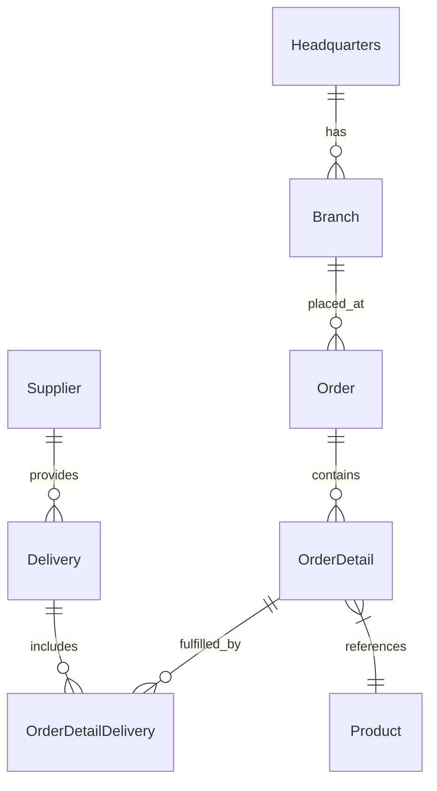

# 🚀 OctoCAT Supply: The Ultimate GitHub Copilot Demo v2.10.7


Welcome to the OctoCAT Supply Website - your go-to demo for showcasing the incredible capabilities of GitHub Copilot, GHAS, and the power of AI-assisted development!

> [!NOTE]
> For a walkthrough of all demos, check out the [Demo Walkthroughs](./demo/walkthroughs/README.md).

## 🏗️ Architecture

The application is built using modern TypeScript with a clean separation of concerns:



### Tech Stack

- **Frontend**: React 18+, TypeScript, Tailwind CSS, Vite
- **Backend**: Express.js, TypeScript, SQLite, OpenAPI/Swagger
- **Data**: SQLite (file db at `api/data/app.db`; in-memory for tests)
- **DevOps**: Docker

## 🚀 Getting Started

1. Clone this repository
2. Build the projects:

   ```bash
   # Build API and Frontend
   npm install && npm run build
   ```

3. Start the application:

   ```bash
   npm run dev
   ```

Optional: initialize the database explicitly (migrations + seed):

```bash
npm run db:init --workspace=api
```

Handy DB scripts (API workspace):

```bash
# Run migrations only
npm run db:migrate --workspace=api

# Seed data only
npm run db:seed --workspace=api
```

Or use the VS Code tasks:

- `Cmd/Ctrl + Shift + P` -> `Run Task` -> `Build All`
- Use the Debug panel to run `Start API & Frontend`

## 🛠️ MCP Server Setup (Optional)

To showcase extended capabilities:

1. Install Docker/Podman for the GitHub MCP server
2. Use VS Code command palette:
   - `MCP: List servers` -> `playwright` -> `Start server`
   - `MCP: List servers` -> `github` -> `Start server`
3. Configure with a GitHub PAT (required for GitHub MCP server)

## 📚 Documentation

- [Detailed Architecture](./docs/architecture.md)
- [SQLite Integration](./docs/sqlite-integration.md)
- [Complete Demo Script](./demo/walkthroughs/README.md)

Database defaults and env vars:

- DB file: `api/data/app.db` (override with `DB_FILE=/absolute/path/to/file.db`)
- Enable WAL: `DB_ENABLE_WAL=true` (default)
- Foreign keys: `DB_FOREIGN_KEYS=true` (default)

## 🎓 Pro Tips for Solution Engineers

- Practice the demos before customer presentations
- Remember Copilot is non-deterministic - be ready to adapt
- Mix and match demo scenarios based on your audience
- Keep your GitHub PAT handy for MCP demos

---

*This entire project, including the hero image, was created using AI and GitHub Copilot! Even this README was generated by Copilot using the project documentation.* 🤖✨
