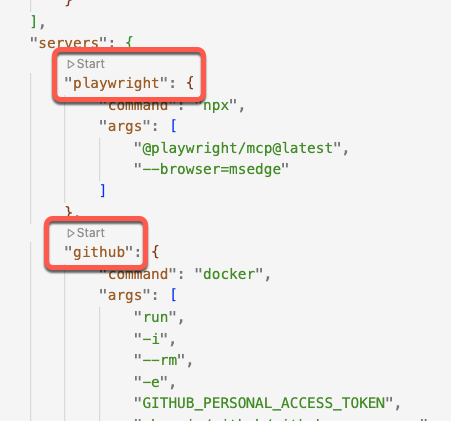

# MCP Server Integration Guide

## Overview

The OctoCAT Supply Demo application leverages the **Model Context Protocol (MCP)** to extend GitHub Copilot's capabilities beyond code completion. MCP servers enable Copilot to interact with external tools, APIs, and services, making it a powerful agent for automation and testing.

## What is MCP?

The Model Context Protocol (MCP) is an open standard that enables AI assistants like GitHub Copilot to:

- **Execute actions** in external tools (browsers, APIs, databases)
- **Retrieve context** from various sources (documentation, repositories, issues)
- **Interact with services** programmatically (GitHub API, Azure services)
- **Extend capabilities** beyond the default toolset

This demo showcases three MCP servers that demonstrate different integration patterns and use cases.

## MCP Servers in This Demo

### 1. Playwright MCP Server

**Purpose**: Browser automation and testing

- **Use Cases**:
  - Visual testing of the frontend application
  - Automated UI/UX validation
  - Generating BDD-style feature files from natural language
  - End-to-end test execution directly from Copilot Chat

- **Key Features**:
  - Navigate to URLs and interact with pages
  - Take screenshots and validate UI elements
  - Fill forms and simulate user interactions
  - Execute Playwright commands from natural language

### 2. GitHub MCP Server

**Purpose**: GitHub API integration

- **Use Cases**:
  - Create and manage issues programmatically
  - Search pull requests and code
  - Manage project boards and milestones
  - Retrieve repository metadata and statistics

- **Key Features**:
  - Full GitHub REST API access
  - Authentication via Personal Access Token (PAT) or OAuth
  - Support for actions, code security, dependabot, issues, PRs, and more
  - Copilot Spaces integration (remote server only)

- **Variants**:
  - **github-local**: Runs via Docker/Podman, requires PAT
  - **github-remote**: Connects to GitHub's hosted MCP server, uses OAuth

### 3. Azure MCP Server

**Purpose**: Azure cloud service integration

- **Use Cases**:
  - Manage Azure resources programmatically
  - Query Azure services and configurations
  - Deploy and monitor cloud infrastructure
  - Access Azure documentation and best practices

- **Key Features**:
  - Multi-service support (App Service, AKS, Storage, etc.)
  - Azure CLI integration
  - Cloud architecture guidance
  - Resource management automation

## Quick Start

### Prerequisites

1. **VS Code** with GitHub Copilot extension installed
2. **Docker** (required for github-local server) or **Podman**
3. **GitHub PAT** with appropriate permissions (for GitHub server)
4. **Internet connection** for MCP server packages

### Starting MCP Servers

#### Option 1: Using VS Code UI

1. Open [.vscode/mcp.json](../../.vscode/mcp.json)
2. Click **Start server** button above each server definition
3. Follow authentication prompts if required



#### Option 2: Using Command Palette

1. Press `Ctrl+Shift+P` (Windows/Linux) or `Cmd+Shift+P` (macOS)
2. Type `MCP: List servers`
3. Select the server you want to start
4. Click `Start server`

### Verifying MCP Server Status

```bash
# Use the Command Palette
MCP: List servers

# Check server status - should show "Running" indicator
```

## Documentation Structure

- **[Setup Guide](./setup.md)**: Detailed installation and configuration instructions
- **[Configuration Reference](./configuration.md)**: Complete configuration options and schema
- **[Tools Reference](./tools-reference.md)**: Complete catalog of available MCP tools
- **[Usage Examples](./usage-examples.md)**: Practical scenarios and demos
- **[Troubleshooting](./troubleshooting.md)**: Common issues and solutions

## Key Concepts

### MCP Protocol Basics

MCP defines a standard way for AI assistants to:

1. **Discover tools** - List available capabilities
2. **Invoke tools** - Execute actions with parameters
3. **Receive results** - Get structured responses
4. **Handle errors** - Gracefully manage failures

### Tool Categories

MCP tools in this demo fall into these categories:

- **Browser Automation** (Playwright): `browser_navigate`, `browser_click`, `browser_screenshot`, etc.
- **GitHub Operations** (GitHub): `create_issue`, `search_pull_requests`, `get_repository`, etc.
- **Azure Services** (Azure): `storage`, `appservice`, `documentation`, etc.

### Authentication Models

- **PAT-based** (github-local): Requires Personal Access Token stored securely
- **OAuth** (github-remote): Uses GitHub OAuth with user consent flow
- **Anonymous** (playwright): No authentication required

## Integration with GitHub Copilot

### Agent Mode

MCP servers work seamlessly with Copilot's Agent Mode:

1. Switch to **Agent** mode in Copilot Chat
2. Use natural language to describe what you want to do
3. Copilot automatically selects and invokes appropriate MCP tools
4. Review and approve tool execution when prompted
5. See results directly in the chat interface

### Example Workflow

```text
You: "Browse to http://localhost:5137 and test the cart functionality"

Copilot: [Uses Playwright MCP]
- browser_navigate to http://localhost:5137
- browser_click on cart icon
- browser_screenshot for validation
```

## Best Practices

### Security

- **Never commit PATs** to version control
- Use **fine-grained tokens** with minimal required permissions
- Regularly **rotate tokens** used for demos
- Store tokens in **secure vaults** (1Password, Azure Key Vault)

### Performance

- **Start only needed servers** - Don't run both github-local and github-remote
- **Clean up** server processes after demos
- **Monitor resource usage** when running multiple servers

### Demo Preparation

- **Test MCP servers** before customer presentations
- **Verify authentication** is still valid
- **Check Docker/Podman** is running (for github-local)
- **Have backup scenarios** ready (Copilot is non-deterministic)

## Contributing

When adding new MCP server integrations:

1. Update `.vscode/mcp.json` with server configuration
2. Document the server in this guide
3. Add usage examples to `usage-examples.md`
4. Update troubleshooting guide with known issues
5. Test thoroughly in both local and Codespace environments

## Resources

### Official Documentation

- [Model Context Protocol Specification](https://spec.modelcontextprotocol.io/)
- [GitHub MCP Server](https://github.com/github/github-mcp-server)
- [Playwright MCP Server](https://github.com/microsoft/playwright-mcp)
- [Azure MCP Server](https://github.com/azure/azure-mcp)

### Related Documentation

- [General Demo Overview](../../demo/walkthroughs/general-demo-overview.md)
- [Copilot Demo Walkthrough](../../demo/walkthroughs/copilot.md)
- [GitHub Copilot Documentation](https://docs.github.com/en/copilot)

---

**Next Steps**: Continue to the [Setup Guide](./setup.md) for detailed configuration instructions.
